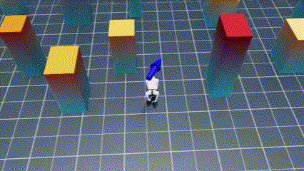
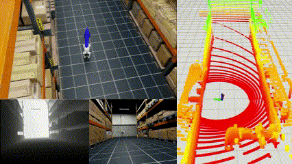
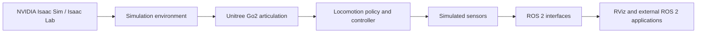

# Unitree Go2 Robotics Simulation with NVIDIA Isaac Sim & ROS 2

[](https://docs.python.org/3/whatsnew/3.10.html)
[](https://docs.ros.org/en/humble/index.html)
[](https://docs.isaacsim.omniverse.nvidia.com/4.5.0/index.html)
[](https://isaac-sim.github.io/IsaacLab/main/source/setup/installation/binaries_installation.html)

## Overview

This repository provides a simulation platform for the Unitree Go2 quadruped robot built on NVIDIA Isaac Sim and Isaac Lab, with bidirectional ROS 2 integration. A reinforcement-learning locomotion policy drives the simulated robot, while cameras, LiDAR, odometry and pose are published to the ROS 2 graph for perception, navigation and control experimentation.

The platform supports robotics simulation and development involving quadruped locomotion, ROS 2 application development, navigation research, perception pipelines, sensor processing, control experimentation and multi-robot simulation.

<table>
  <tr>
    <td></td>
    <td></td>
  </tr>
</table>

## Features

- Unitree Go2 quadruped simulation with articulation, contact sensing and height scanning
- NVIDIA Isaac Sim scene construction with configurable warehouse and obstacle environments
- NVIDIA Isaac Lab environment and observation/action configuration
- Reinforcement-learning locomotion controller with trained flat and rough-terrain policies
- Keyboard teleoperation of robot velocity
- ROS 2 velocity command subscription (`cmd_vel`)
- Front RGB camera publishing
- Front depth image publishing
- Semantic segmentation image publishing with color-mapped visualization
- Camera info publishing
- RTX LiDAR point-cloud publishing
- Odometry and robot pose publishing with TF transforms
- RViz visualization configuration
- Multi-robot simulation with per-robot ROS 2 namespaces

## System Requirements

- Ubuntu 22.04
- NVIDIA Isaac Sim 4.5
- Isaac Lab 2.1
- ROS 2 Humble
- Python 3.10 (through the Isaac Lab conda environment)
- NVIDIA GPU with a driver compatible with Isaac Sim 4.5

The Isaac Sim, Isaac Lab and ROS 2 versions must be mutually compatible. Install them in the order listed under Installation before running the simulation.

## Repository Structure

```text
cfg/
  sim.yaml                  Simulation and runtime configuration.
ckpts/unitree_go2/
  flat_model_6800.pt        Trained locomotion policy, flat terrain.
  rough_model_7850.pt       Trained locomotion policy, rough terrain.
env/
  sim_env.py                Simulation environment definitions (warehouses, obstacles).
  terrain.py                Procedural discrete-obstacle terrain generation.
  terrain_cfg.py            Terrain generator configuration.
go2/
  go2_env.py                Unitree Go2 scene, observation and action configuration.
  go2_ctrl.py               Locomotion policy loading, velocity commands, keyboard input.
  go2_ctrl_cfg.py           Policy runner configuration for both checkpoints.
  go2_sensors.py            Camera and RTX LiDAR setup, one set per robot.
ros2/
  go2_ros2_bridge.py        ROS 2 node: subscribers, publishers, TF, simulation clock.
rviz/
  go2.rviz                  RViz visualization configuration.
media/
  sim-demo1.gif             Demo recording used by this README.
  sim-demo2.gif             Demo recording used by this README.
isaac_go2_ros2.py           Primary simulation entry point.
```

## Installation

1. Install the NVIDIA GPU driver recommended for Isaac Sim 4.5.
2. Install Isaac Sim 4.5 following the official download and installation guide. The default location used below is `${HOME}/isaacsim`.
3. Install Isaac Lab 2.1 following the official binaries installation guide. This creates the `env_isaaclab` conda environment used to run the simulation.
4. Install ROS 2 Humble following the official installation guide.
5. Clone this repository and enter it:

```bash
git clone https://github.com/rithwik-01/robotics-simulation-platform.git
cd robotics-simulation-platform
```

6. Activate the Isaac Lab environment and make sure the ROS 2 environment is sourced in the same shell before launching:

```bash
conda activate env_isaaclab
source /opt/ros/humble/setup.bash
```

7. Review `cfg/sim.yaml` and adjust the environment name, robot count, control frequency and sensor flags for your run.

## Configuration

All runtime options live in `cfg/sim.yaml`:

- `num_envs`: number of simulated Go2 robots. Values greater than 1 namespace topics and frames per robot as `unitree_go2_{i}/...`.
- `freq`: control frequency in Hz. Must divide 200 evenly because the physics step is 0.005 s.
- `camera_follow`: follow the first robot with the viewport camera.
- `env_name`: simulation scene. One of `obstacle-dense`, `obstacle-medium`, `obstacle-sparse`, `warehouse`, `warehouse-forklifts`, `warehouse-shelves`, `full-warehouse`.
- `sensor.enable_lidar` / `sensor.enable_camera`: master switches for LiDAR and camera publishing.
- `sensor.color_image` / `sensor.depth_image` / `sensor.semantic_segmentation`: per-stream camera switches.
- `sim_app`: Isaac Sim display preferences (window size, UI visibility, anti-aliasing).

The locomotion policy selection is code-level: the entry point loads the rough-terrain checkpoint by default, and `go2/go2_ctrl.py` also provides the flat-terrain policy loader with its checkpoint in `ckpts/unitree_go2/`.

## Running the Simulation

```bash
conda activate env_isaaclab
source /opt/ros/humble/setup.bash
python isaac_go2_ros2.py
```

The script builds the configured scene, loads the locomotion policy, attaches one camera and one RTX LiDAR per robot, starts the ROS 2 bridge node and steps the simulation with real-time pacing.

## Controls

With the simulator viewport focused, drive the first robot with the keyboard:

- `W`: forward, `S`: backward, `A`: left, `D`: right
- `Z`: turn left, `C`: turn right

Releasing a key stops the commanded motion. When `num_envs` is greater than 1, a second key set (`I`/`J`/`K`/`L`/`M`) drives the second robot. Velocity commands received on `cmd_vel` write to the same command interface and take effect on the next policy step.

## ROS 2 Integration

`ros2/go2_ros2_bridge.py` implements the `robot_data_manager` node inside the Isaac Sim process. It publishes the simulation clock on `/clock`, enables sim time on the node, subscribes to velocity commands and publishes odometry, pose, camera and LiDAR data each step. Static base-to-LiDAR and base-to-camera transforms are broadcast at startup, and the map-to-base transform is updated with every odometry message.

## ROS 2 Topics

Single-robot topic names are shown. With `num_envs` greater than 1, every `unitree_go2/...` prefix becomes `unitree_go2_{i}/...` where `i` is the robot index, and frames are namespaced the same way.

| Topic | Message Type | Direction | Description |
| --- | --- | --- | --- |
| `/unitree_go2/cmd_vel` | `geometry_msgs/msg/Twist` | Subscribe | Robot velocity command |
| `/unitree_go2/front_cam/color_image` | `sensor_msgs/msg/Image` | Publish | Front RGB camera image |
| `/unitree_go2/front_cam/depth_image` | `sensor_msgs/msg/Image` | Publish | Front depth image |
| `/unitree_go2/front_cam/semantic_segmentation_image` | `sensor_msgs/msg/Image` | Publish | Semantic segmentation image |
| `/unitree_go2/front_cam/semantic_segmentation_image_vis` | `sensor_msgs/msg/Image` | Publish | Color-mapped segmentation visualization |
| `/unitree_go2/front_cam/info` | `sensor_msgs/msg/CameraInfo` | Publish | Camera intrinsic parameters |
| `/unitree_go2/lidar/point_cloud` | `sensor_msgs/msg/PointCloud2` | Publish | RTX LiDAR point cloud |
| `/unitree_go2/odom` | `nav_msgs/msg/Odometry` | Publish | Robot odometry in the `map` frame |
| `/unitree_go2/pose` | `geometry_msgs/msg/PoseStamped` | Publish | Robot pose in the `map` frame |

Semantic label metadata is additionally forwarded on `.../front_cam/semantic_segmentation_label`. Relevant frames are `map`, `unitree_go2/base_link`, `unitree_go2/lidar_frame` and `unitree_go2/front_cam`.

## RViz Visualization

Load the included configuration with the fixed `map` frame:

```bash
rviz2 -d rviz/go2.rviz
```

It visualizes the LiDAR point cloud, the robot pose, and the front color and depth images. Make sure the simulation is running first so the topics and TF tree exist.

## Simulation Environments

The scene is selected with `env_name` in `cfg/sim.yaml` and built by `env/sim_env.py`:

- `warehouse`: base warehouse interior.
- `warehouse-forklifts`: warehouse with forklifts.
- `warehouse-shelves`: warehouse with shelf rows.
- `full-warehouse`: complete warehouse combining the above.
- `obstacle-sparse` / `obstacle-medium` / `obstacle-dense`: procedurally generated obstacle fields with 100, 200 and 400 obstacles on a 50 m square, a flat spawn platform and enforced minimum obstacle spacing.

Warehouse scenes load USD assets from the Isaac Sim Nucleus asset root and require those assets to be available. Obstacle scenes are generated locally and need no downloads.

## Multi-Robot Simulation

Set `num_envs` in `cfg/sim.yaml` to spawn multiple Go2 robots. Each robot gets its own articulation instance, camera, LiDAR annotator and namespaced ROS 2 interface (`unitree_go2_{i}/...` topics and `unitree_go2_{i}/...` frames). Velocity commands and sensor streams are routed per index, so robots can be driven and observed independently. Camera follow tracks the first robot only.

## Architecture



Isaac Sim and Isaac Lab own scene construction, physics and the Gym-style environment. The Go2 articulation and trained locomotion policy close the low-level control loop from velocity commands to joint targets. Simulated cameras and LiDAR feed the ROS 2 bridge, which exposes standard topics, TF and the simulation clock to RViz and any external ROS 2 node.

## Troubleshooting

- If external ROS 2 nodes warn about time, confirm `/clock` is being published and that the nodes run with sim time enabled. The bridge sets `use_sim_time` on `robot_data_manager` itself at startup.
- If the simulation fails during environment construction, check that `freq` in `cfg/sim.yaml` divides 200 evenly.
- If a warehouse scene fails to load, verify the Isaac Sim Nucleus assets are downloaded and reachable; switch to an `obstacle-*` scene to test without asset downloads.

## Acknowledgements

This project builds on NVIDIA Isaac Sim and NVIDIA Isaac Lab for simulation, the Unitree Go2 quadruped platform for the robot model, and ROS 2 for robot communication and visualization.

## License

This repository is distributed under the MIT License. See [LICENSE](LICENSE) for the full text.
